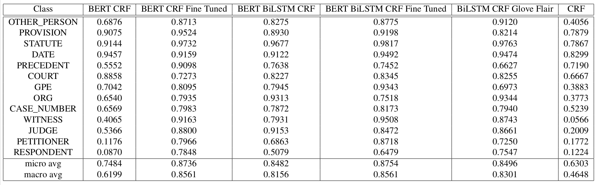
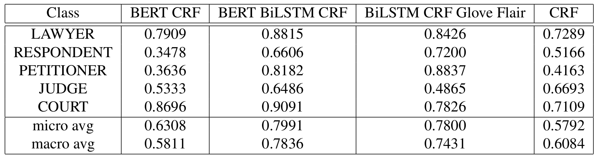

# semeval_2023_6b
A repo for the final shared task CSCI 5832, Fall 2022. This repo attempts to solve the task of Named Entity recognition (NER) on Indian legal documents.

## Task: Semeval 2023 Task 6 - LegalEval: Understanding Legal Texts

Sub-task B: Legal Named Entities Extraction (L-NER)
More details for this task can be found [here](https://sites.google.com/view/legaleval/home?pli=1#h.fbpoqsn0hjeh) and the dataset and baseline model developed can be found [here](https://github.com/Legal-NLP-EkStep/legal_NER).

This repo presents 4 model architectures used for the task. These include the following:
* CRF with hand-crafted features
* BiLSTM CRF with GloVe and Flair embeddings
* BiLSTM CRF with BERT embeddings
* BERT CRF

The code for CRF with hand-crafter features is present in CRF.ipynb and the code for the rest of the models is present in legal_ner.ipynb.

## Results

The F1-scores we got for NER on judgement data are presented in the table below.

The F1-scores for preamble data are presented in the table below.

A detailed report of our findings can be found [here](/5832_Assignment_on_LNER.pdf).